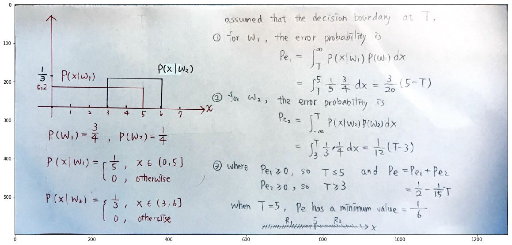

# DLCV HW\#1 - d05921027 張鈞閔

# Problem 1


```python
from sklearn.datasets import load_iris
from sklearn.model_selection import cross_val_score
from sklearn.tree import DecisionTreeClassifier
clf = DecisionTreeClassifier(random_state=0)
iris = load_iris()
```


```python
iris.target
```


    array([0, 0, 0, 0, 0, 0, 0, 0, 0, 0, 0, 0, 0, 0, 0, 0, 0, 0, 0, 0, 0, 0,
           0, 0, 0, 0, 0, 0, 0, 0, 0, 0, 0, 0, 0, 0, 0, 0, 0, 0, 0, 0, 0, 0,
           0, 0, 0, 0, 0, 0, 1, 1, 1, 1, 1, 1, 1, 1, 1, 1, 1, 1, 1, 1, 1, 1,
           1, 1, 1, 1, 1, 1, 1, 1, 1, 1, 1, 1, 1, 1, 1, 1, 1, 1, 1, 1, 1, 1,
           1, 1, 1, 1, 1, 1, 1, 1, 1, 1, 1, 1, 2, 2, 2, 2, 2, 2, 2, 2, 2, 2,
           2, 2, 2, 2, 2, 2, 2, 2, 2, 2, 2, 2, 2, 2, 2, 2, 2, 2, 2, 2, 2, 2,
           2, 2, 2, 2, 2, 2, 2, 2, 2, 2, 2, 2, 2, 2, 2, 2, 2, 2])


```python
import cv2
import matplotlib.pyplot as plt
%matplotlib inline

prob1 = cv2.imread("prob1.jpg", 1)
plt.figure(figsize=(20,20))
plt.imshow(prob1)
```


    <matplotlib.image.AxesImage at 0x11b621c50>





# Problem 2 


```python
import os
import numpy as np
import pandas as pd

from sklearn.decomposition import PCA
from sklearn.model_selection import GridSearchCV
from sklearn.metrics import accuracy_score
from sklearn.neighbors import KNeighborsClassifier

data_dir = "data/"
```


```python
ftrain = []
ytrain = []
for i in range(40):
    for j in range(6):
        ftrain.append(os.path.join(data_dir, str(i+1)+"_"+str(j+1)+".png"))
        ytrain.append(i)
print("number of training images:",len(ftrain))

original_shape = cv2.imread(ftrain[0],0).shape
print("original shape:",original_shape)

xtrain = []
for fn in ftrain:
    tmp = cv2.imread(fn,0)
    tmp = tmp.reshape(-1)
    xtrain.append(tmp)
xtrain = np.array(xtrain)
ytrain = np.array(ytrain)
print("training dataset for PCA, its shape =",xtrain.shape)
```

    number of training images: 240
    original shape: (56, 46)
    training dataset for PCA, its shape = (240, 2576)


# (a) mean face and the first three eigenfaces  


```python
mean_face = np.mean(xtrain,axis=0)
mean_face = np.reshape(mean_face,newshape=original_shape)

pca = PCA(n_components=min(xtrain.shape)-1)
e = pca.fit(xtrain-mean_face.reshape(-1))
pc1 = np.reshape(e.components_[0],newshape=original_shape)
pc2 = np.reshape(e.components_[1],newshape=original_shape)
pc3 = np.reshape(e.components_[2],newshape=original_shape)

plt.figure(figsize=(20,16))
plt.subplot(141)
plt.imshow(mean_face, cmap='gray')
plt.title("mean face")
plt.subplot(142)
plt.imshow(pc1,cmap='gray')
plt.title("eigenface 1")
plt.subplot(143)
plt.imshow(pc2,cmap='gray')
plt.title("eigenface 2")
plt.subplot(144)
plt.imshow(pc3,cmap='gray')
plt.title("eigenface 3")
plt.subplots_adjust(top=0.92, bottom=0.08, left=0.10, right=0.95, hspace=0.25,wspace=0.35)
plt.show()
plt.close()
```


# (b) reconstruction


```python
target = cv2.imread("data/1_1.png",0)
plt.figure(figsize=(20,16))
plt.subplot(1,5,1)
plt.title("person1_1")
plt.imshow(target, cmap="gray")

target = np.reshape(target,newshape=(1,-1))
e_target = e.transform(target - mean_face.reshape(-1))

n = [3,50,100,239]
for k in range(len(n)):
    tmp = np.dot(e_target[0,:n[k]], e.components_[:n[k]]) + mean_face.reshape(-1)
    mse = np.mean((tmp - target)**2)
    tmp = np.reshape(tmp, newshape=original_shape)
    plt.subplot(1,5,k+2)
    plt.title("n=%s, mse=%.4f" % (n[k], mse))
    plt.imshow(tmp, cmap='gray')
plt.subplots_adjust(top=0.92, bottom=0.08, left=0.1, right=0.95, hspace=0.25,wspace=0.35)
plt.show()
plt.close()
```


  

# (c) kNN in projected spaces 


```python
ptrain = e.transform(xtrain-mean_face.reshape(-1))
ytrain = np.array(ytrain)

params = {'n_neighbors':[1,3,5]}
kNN = KNeighborsClassifier()
clf = GridSearchCV(kNN, params,cv=3)

n = [3, 50, 159]
res = dict()
for k in n:
    clf.fit(ptrain[:,:k], ytrain)
    res['n='+str(k)] = np.array(clf.cv_results_['mean_test_score'])
res = pd.DataFrame.from_dict(res,orient='index')
res.columns = ['k=1','k=3','k=5']
print(res)
```

                k=1       k=3       k=5
    n=3    0.708333  0.587500  0.487500
    n=50   0.929167  0.875000  0.775000
    n=159  0.925000  0.870833  0.745833


### Best choice: k=1, n=50


```python
k, n = 1, 50
```


```python
# get testing filenames and labels
ftest = []
ytest = []
for i in range(40):
    for j in range(6,10):
        ftest.append(os.path.join(data_dir, str(i+1)+"_"+str(j+1)+".png"))
        ytest.append(i)
print("number of test images:",len(ftest))

# read testing images
xtest = []
for fn in ftest:
    tmp = cv2.imread(fn,0)
    tmp = tmp.reshape(-1)
    xtest.append(tmp)
xtest = np.array(xtest)
ytest = np.array(ytest)
print("testing dataset, its shape =",xtest.shape)

# Project images onto the principal components
ptest = e.transform(xtest-mean_face.reshape(-1))
print("projected testing dataset, its shape=", ptest.shape)
```

    number of test images: 160
    testing dataset, its shape = (160, 2576)
    projected testing dataset, its shape= (160, 239)


```python
# kNN model with optimized hyper-parameter (k,n)
bestkNN = KNeighborsClassifier(n_neighbors=k)
bestkNN.fit(ptrain[:,:n], ytrain)
ypred = bestkNN.predict(ptest[:,:50])
print("overall accuracy:",accuracy_score(y_pred=ypred, y_true=ytest))
```

    overall accuracy: 0.9625


# bonus

(1) $A$ is a $d \times d$ sysmetric matrix, so $A$ is diagonalizable and here we denote the $d$ diagonal elements as $\lambda_{1},\space \lambda_{2}, \space \dots, \space\lambda_{d}$, where $\lambda_{1}$ is the largest value of elements

(2) The corresponding eigenvectors of the $d$ distinct eigenvalues are $\vec{x_{1}}, \space\vec{x_{2}}, \space\dots, \space\vec{x_{d}}$, and can be viewed as a basis of a $d$-dimension space

(3) Based on (2), without loss of generality, initialize a $d$-dimension vector, $\vec{u_{0}}$, can be represented as $\vec{u_{0}}=c_{1}\cdot\vec{x_{1}}+c_{2}\cdot\vec{x_{2}}+...+c_{d}\cdot\vec{x_{d}}$

(4) Based on (3) and (4),

$\vec{u_{1}}=A\cdot\vec{u_{0}}=c_{1}\cdot\lambda_{1}\cdot\vec{x_{1}}+c_{2}\cdot\lambda_{2}\cdot\vec{x_{2}}+...+c_{d}\cdot\lambda_{d}\cdot\vec{x_{d}}$

$\vec{u_{2}}=A^{2}\cdot\vec{u_{0}}=c_{1}\cdot\lambda_{1}^{2}\cdot\vec{x_{1}}+c_{2}\cdot\lambda_{2}^{2}\cdot\vec{x_{2}}+...+c_{d}\cdot\lambda_{d}^{2}\cdot\vec{x_{d}} $

$\vec{u_{k}}=A^{k}\cdot\vec{u_{0}}=c_{1}\cdot\lambda_{1}^{k}\cdot\vec{x_{1}}+c_{2}\cdot\lambda_{2}^{k}\cdot\vec{x_{2}}+...+c_{d}\cdot\lambda_{d}^{k}\cdot\vec{x_{d}}$

=> $\vec{u_{k}}=\lambda_{1}^{k}[c_{1}\cdot\vec{x_{1}}+c_{2}\cdot\frac{\lambda_{2}^{k}}{\lambda_{1}^{k}}\cdot\vec{x_{2}}+...+c_{d}\cdot\frac{\lambda_{d}^{k}}{\lambda_{1}^{k}}\cdot\vec{x_{d}}]$ $\space$ => $\space$ $\vec{u_{k}} \approx \lambda_{1}^{k}\cdot c_{1} \cdot \vec{x}_{1}$ for large k

(5) Normalize $\vec{u_{k}}$ to a unit vector by $\frac{\vec{u_{k}}}{|\vec{u_{k}}|}$, and finally we obtain a unit vector which is in the same direction of the first eigenvector.
