# DLCV HW\#2 - d05921027 張鈞閔


```python
from IPython.display import HTML

HTML('''<script>
code_show=true; 
function code_toggle() {
 if (code_show){
 $('div.input').hide();
 } else {
 $('div.input').show();
 }
 code_show = !code_show
} 
$( document ).ready(code_toggle);
</script>
<form action="javascript:code_toggle()"><input type="submit" value="Click here to toggle on/off the raw code."></form>''')
```


<script>
code_show=true; 
function code_toggle() {
 if (code_show){
 $('div.input').hide();
 } else {
 $('div.input').show();
 }
 code_show = !code_show
} 
$( document ).ready(code_toggle);
</script>
<form action="javascript:code_toggle()"><input type="submit" value="Click here to toggle on/off the raw code."></form>


```python
import os
import numpy as np
import cv2
import scipy.io
import scipy.signal
from sklearn.cluster import KMeans, MiniBatchKMeans
from sklearn.decomposition import PCA
from sklearn.metrics import accuracy_score
from sklearn.neighbors import KNeighborsClassifier
import matplotlib.pyplot as plt
%matplotlib inline
from mpl_toolkits.mplot3d import Axes3D
```

## Problem 1 


```python
image = cv2.imread("Problem1.JPG")
plt.figure(figsize=(16,10))
plt.imshow(image)
```


    <matplotlib.image.AxesImage at 0x121bb9ef0>


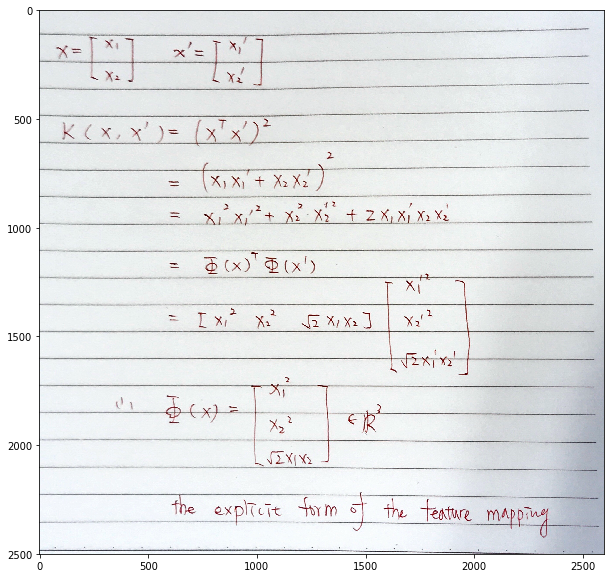


## Problem 2 

### (a) color segmentation 


```python
def TenColorKMeans(img_path, use_lab=False):
    image = cv2.imread(img_path)
    if use_lab:
        image = cv2.cvtColor(image, cv2.COLOR_RGB2LAB)
    flatten_image = image.reshape(-1,3)
    kmeans = KMeans(n_clusters=10,max_iter=1000)
    kmeans.fit(flatten_image)
    
    color_array = [[166,206,227],[31,120,180],[178,223,138],[51,160,44],[251,154,153],
                   [227,26,28],[253,191,111],[255,127,0],[202,178,214],[106,61,154]]

    res_image = np.array([color_array[i] for i in kmeans.labels_])
    res_image = res_image.reshape(image.shape)
    return res_image
```

### (a-i) RGB color space


```python
mountain = TenColorKMeans("Problem2/mountain.jpg")
zebra = TenColorKMeans("Problem2/zebra.jpg")
```


```python
plt.figure(figsize=(16,8))
plt.subplot(1,2,1)
plt.title("mountain (RGB color space)")
plt.imshow(mountain)
plt.subplot(1,2,2)
plt.title("zebra (RGB color space)")
plt.imshow(zebra)
plt.show()
```


### (a-ii) Lab color space 


```python
mountain_lab = TenColorKMeans("Problem2/mountain.jpg", use_lab=True)
zebra_lab = TenColorKMeans("Problem2/zebra.jpg", use_lab=True)
```


```python
plt.figure(figsize=(16,8))
plt.subplot(1,2,1)
plt.title("mountain (Lab color space)")
plt.imshow(mountain_lab)
plt.subplot(1,2,2)
plt.title("zebra(Lab color space)")
plt.imshow(zebra_lab)
plt.show()
```


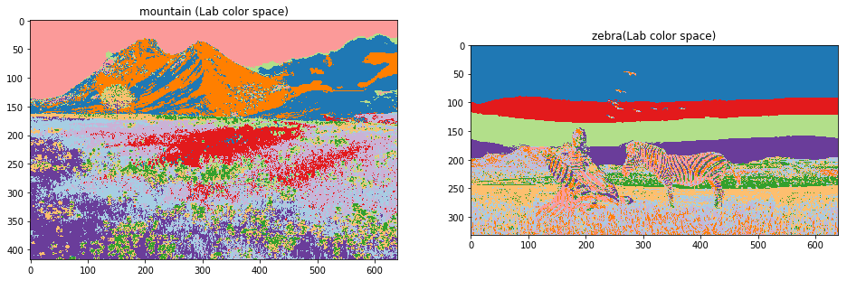


### (b) texture segmentation 

### (b-i)  texture only


```python
def TextureKMeans(image_path, add_lab=False):
    image = cv2.imread(image_path)
    
    # convert to gray scale
    grayimage = cv2.cvtColor(image, cv2.COLOR_RGB2GRAY)
    
    # load existing filters
    filters = scipy.io.loadmat('Problem2/filterBank.mat')["F"]
    
    # generate feature maps
    
    feature_map = []
    for i in range(filters.shape[2]):
        conv = scipy.signal.convolve2d(grayimage, filters[:,:,i], mode="same", boundary="symm")
        feature_map.append(conv)
    feature_map = np.dstack(feature_map)
    
    # flatten feature maps
    flatten_map = feature_map.reshape(-1,38)
    
    # add flatten lab features or not
    if add_lab:
        labimage = cv2.cvtColor(image, cv2.COLOR_RGB2LAB)
        flatten_lab = labimage.reshape(-1,3)
        flatten_map = np.concatenate((flatten_map, flatten_lab), axis=1)
        
    
    # perform KMeans
    kmeans = KMeans(n_clusters=6,max_iter=1000)
    kmeans.fit(flatten_map)
    
    # conver to specific 6 colors
    color_array = [[166,206,227],[31,120,180],[178,223,138],[51,160,44],[251,154,153],[227,26,28]]

    res_image = np.array([color_array[i] for i in kmeans.labels_])
    res_image = res_image.reshape(image.shape)
    return res_image
```


```python
mountain_texture = TextureKMeans("Problem2/mountain.jpg")
zebra_texture = TextureKMeans("Problem2/zebra.jpg")
```


```python
plt.figure(figsize=(16,8))
plt.subplot(1,2,1)
plt.title("mountain (Texture)")
plt.imshow(mountain_texture)
plt.subplot(1,2,2)
plt.title("zebra (Texture)")
plt.imshow(zebra_texture)
plt.show()
```


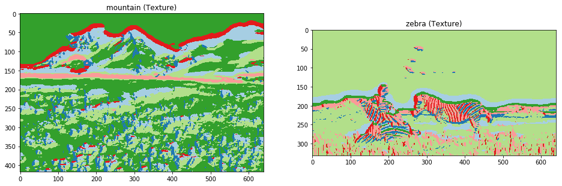


### (b-ii) RGB+texture 


```python
mountain_rgb_texture = TextureKMeans("Problem2/mountain.jpg", add_lab=True)
zebra_rgb_texture = TextureKMeans("Problem2/zebra.jpg", add_lab=True)
```


```python
plt.figure(figsize=(16,8))
plt.subplot(1,2,1)
plt.title("mountain (Lab + Texture)")
plt.imshow(mountain_rgb_texture)
plt.subplot(1,2,2)
plt.title("zebra (Lab + Texture)")
plt.imshow(zebra_rgb_texture)
plt.show()
```


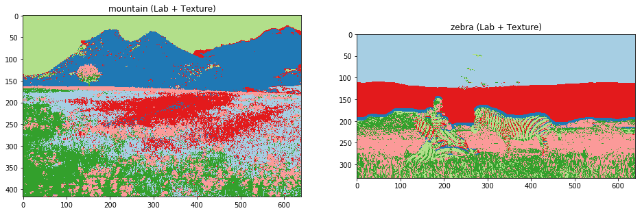


## Problem 3 

### (a) randomly sample one image and extract its top 30 SURF interest points


```python
def ExtractSURF(image,thre):
    surf = cv2.xfeatures2d.SURF_create(thre)
    points, descriptors = surf.detectAndCompute(image, None)
    return points, descriptors
```


```python
image = cv2.imread("Problem3/train-10/Highway/image_0009.jpg",0) # read in grayscale
points, descriptors = ExtractSURF(image,1700)
color_image = cv2.cvtColor(image, cv2.COLOR_GRAY2RGB)
for p in points:
    cv2.circle(color_image, (int(p.pt[0]),int(p.pt[1])), radius=1, color=(255,255,0), thickness=2)
plt.imshow(color_image)
plt.show()
```


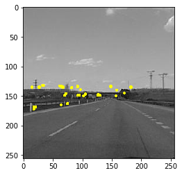


### (b) Visual words (KMeans) on the Train-10 dataset and Visualize in PCA features


```python
file_list = []
for dirPath, dirNames, fileNames in os.walk("Problem3/train-10/"):
    for file in fileNames:
        file_list.append(os.path.join(dirPath, file))
```


```python
sep_points_list = []
sep_descriptors_list = []
for file in file_list:
    image = cv2.imread(file,0)
    points, descriptors = ExtractSURF(image,1000)
    sep_points_list.append(points)
    sep_descriptors_list.append(descriptors)
points_list = np.concatenate(sep_points_list,axis=0)
descriptors_list = np.concatenate(sep_descriptors_list,axis=0)

print("interest points", points_list.shape)
print("descriptors:", descriptors_list.shape)
```

    interest points (9332,)
    descriptors: (9332, 64)


```python
# perform KMeans, C=50, iter=5000
kmeans = KMeans(n_clusters=50,max_iter=5000)
kmeans.fit(descriptors_list)

# get centers and cluster labels
centers = kmeans.cluster_centers_
clusters = kmeans.labels_
```


```python
# PCA
pca = PCA(n_components=3)
pca_descriptors = pca.fit_transform(descriptors_list)
print("pca descriptors:",pca_descriptors.shape)
```

    pca descriptors: (9332, 3)


```python
# sample 6 clusters
sample_clusters = np.random.choice(np.unique(clusters), size=6, replace=False)

# sampled 6 centers and its pca
sample_centers = centers[sample_clusters]
sample_pca_centers = pca.transform(sample_centers)
```


```python
# generate color dictionary for the 6 sampled clusters
color_array = ['b', 'g', 'r', 'c', 'm', 'y']
color_dict = dict()
for idx,clu in enumerate(sample_clusters):
    color_dict[clu] = color_array[idx]
```


```python
# sampled descriptors and its pca
sample_pca_descriptors = pca_descriptors[np.isin(element=clusters,test_elements=sample_clusters)]
sample_colors = []
for clu in clusters[np.isin(element=clusters,test_elements=sample_clusters)]:
    sample_colors.append(color_dict[clu])
```


```python
fig = plt.figure(figsize=(16,8))
ax = Axes3D(fig)
ax.scatter(sample_pca_descriptors[:,0], sample_pca_descriptors[:,1], sample_pca_descriptors[:,2],
           c=sample_colors,alpha=0.2)
ax.scatter(sample_pca_centers[:,0], sample_pca_centers[:,1], sample_pca_centers[:,2],
           s=100, marker = 'o',
           c=color_array, alpha=1)
ax.set_title("Sample 6 clusters")
ax.set_xlabel('x-axis')
ax.set_ylabel('y-axis')
ax.set_zlabel('z-axis')
plt.show()
```


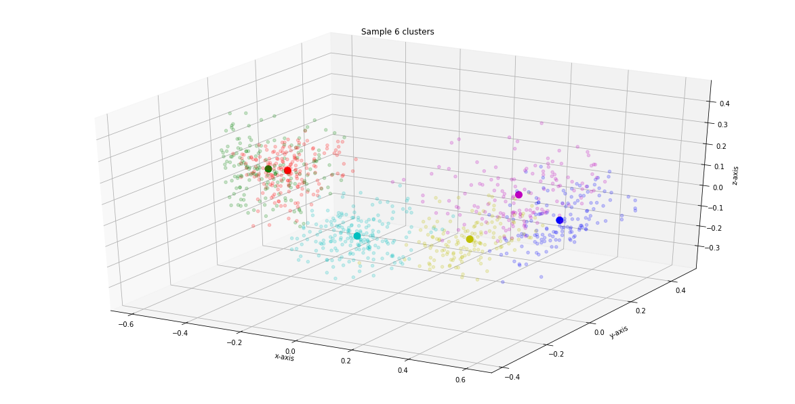


### (c) Bag of visual words: Hard-Sum, Soft-Sum, Soft-Max


```python
def BOW(sep_descriptors_list, centers, types=None):
    assert sep_descriptors_list[0].shape[1]==centers.shape[1], "shape not matched"
    def HardSum(dist):
        def where_max(arr):
            return np.where(arr==np.max(arr))[0][0]
        maxidx = np.apply_along_axis(where_max, 1, dist)
        count = np.zeros(centers.shape[0])
        for idx in maxidx:
            count[idx] +=1
        return count/np.sum(count)
    
    def SoftSum(dist):
        dist = np.reciprocal(dist)
        def norm_sum_one(arr):
            return arr/np.sum(arr)
        normalized = np.apply_along_axis(norm_sum_one,1, dist)
        softsum = np.apply_along_axis(np.mean, 0, normalized)
        return softsum#/np.sum(softsum)
    
    def SoftMax(dist):
        dist = np.reciprocal(dist)
        def norm_sum_one(arr):
            return arr/np.sum(arr)
        normalized = np.apply_along_axis(norm_sum_one,1, dist)
        softmax = np.apply_along_axis(max, 0, normalized)
        return softmax

    result = []
    for i in range(len(sep_descriptors_list)):
        # calculate the similarity
        dist = np.dot(centers,sep_descriptors_list[i].T).T
        
        if types=="HardSum":
            a = HardSum(dist)
        elif types=="SoftSum":
            a = SoftSum(dist)
        elif types=="SoftMax":
            a = SoftMax(dist)
        else:
            raise NameError('types must be one of the following three: HardSum, SoftSum, SoftMax.')
        result.append(a)
    return np.array(result)
```


```python
hardsum = BOW(sep_descriptors_list, centers, "HardSum")
softsum = BOW(sep_descriptors_list, centers, "SoftSum")
softmax = BOW(sep_descriptors_list, centers, "SoftMax")
```


```python
for i in range(5):
    plt.figure(figsize=(15,3))
    plt.subplot(1,3,1)
    plt.title(os.path.basename(os.path.dirname(file_list[10*i]))+": HardSum")
    plt.bar(np.arange(hardsum.shape[1]), hardsum[10*i] )
    plt.subplot(1,3,2)
    plt.title(os.path.basename(os.path.dirname(file_list[10*i]))+": SoftSum")
    plt.bar(np.arange(softsum.shape[1]), softsum[10*i] )
    plt.subplot(1,3,3)
    plt.title(os.path.basename(os.path.dirname(file_list[10*i]))+": SoftMax")
    plt.bar(np.arange(softmax.shape[1]), softmax[10*i] )
    plt.show()
```


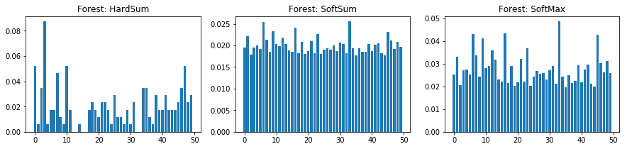


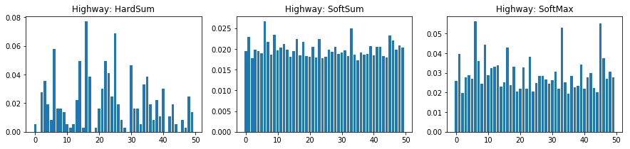


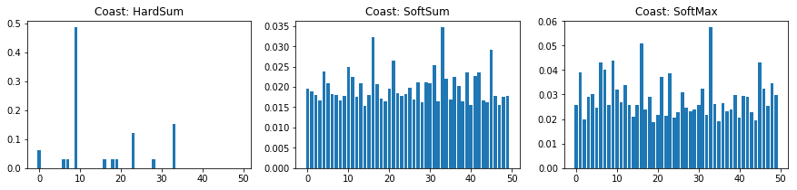


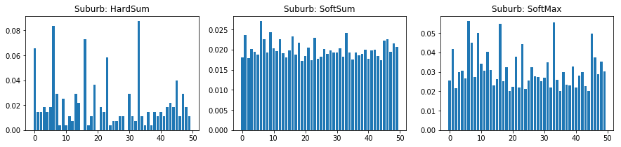


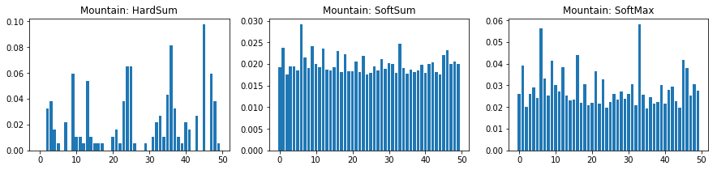


I think **SoftMax** is a better BoW strategy for classification because, for an image, SoftMax preserves the maximum likely description in the each visual word. Moreover, using soft labels benefits the smoothness of decision boundaries, which is good for generalization. 

### (d-i) kNN on Test-100 


```python
ytrain = np.repeat([0,1,2,3,4], repeats=10)
```


```python
# hardsum KNN
knn_hardsum = KNeighborsClassifier(n_neighbors=10)
knn_hardsum.fit(hardsum, ytrain)

# softsum KNN
knn_softsum = KNeighborsClassifier(n_neighbors=10)
knn_softsum.fit(softsum, ytrain) 

# softmax KNN
knn_softmax = KNeighborsClassifier(n_neighbors=10)
knn_softmax.fit(softmax, ytrain)

print("Trained kNN on Train-10 dataset.")
```

    Trained kNN on Train-10 dataset.


```python
test_list = []
for dirPath, dirNames, fileNames in os.walk("Problem3/test-100/"):
    for file in fileNames:
        test_list.append(os.path.join(dirPath, file))
test_sep_points_list = []
test_sep_descriptors_list = []
for file in test_list:
    image = cv2.imread(file,0)
    points, descriptors = ExtractSURF(image,1000)
    test_sep_points_list.append(points)
    test_sep_descriptors_list.append(descriptors)
test_points_list = np.concatenate(test_sep_points_list,axis=0)
test_descriptors_list = np.concatenate(test_sep_descriptors_list,axis=0)

print("Test-100 interest points:", test_points_list.shape)
print("Test-100 descriptors:", test_descriptors_list.shape)
```

    Test-100 interest points: (94492,)
    Test-100 descriptors: (94492, 64)


```python
test_hardsum = BOW(test_sep_descriptors_list, centers, "HardSum")
test_softsum = BOW(test_sep_descriptors_list, centers, "SoftSum")
test_softmax = BOW(test_sep_descriptors_list, centers, "SoftMax")
```


```python
ytest = np.repeat([0,1,2,3,4],repeats=100)
```


```python
print("Test-100 accuracy of HardSum: ", accuracy_score(y_pred=knn_hardsum.predict(test_hardsum), y_true=ytest))
print("Test-100 accuracy of SoftSum: ", accuracy_score(y_pred=knn_softsum.predict(test_softsum), y_true=ytest))
print("Test-100 accuracy of SoftMax: ", accuracy_score(y_pred=knn_softmax.predict(test_softmax), y_true=ytest))
```

    Test-100 accuracy of HardSum:  0.46
    Test-100 accuracy of SoftSum:  0.366
    Test-100 accuracy of SoftMax:  0.496


###  (d-ii) Train on Train-100 and test on Test-100


```python
train_list = []
for dirPath, dirNames, fileNames in os.walk("Problem3/train-100/"):
    for file in fileNames:
        train_list.append(os.path.join(dirPath, file))
```


```python
train_sep_points_list = []
train_sep_descriptors_list = []
for file in train_list:
    image = cv2.imread(file,0)
    points, descriptors = ExtractSURF(image,1000)
    train_sep_points_list.append(points)
    train_sep_descriptors_list.append(descriptors)
train_points_list = np.concatenate(train_sep_points_list,axis=0)
train_descriptors_list = np.concatenate(train_sep_descriptors_list,axis=0)

print("Train-100 interest points", train_points_list.shape)
print("Train-100 descriptors:", train_descriptors_list.shape)
```

    Train-100 interest points (102521,)
    Train-100 descriptors: (102521, 64)


```python
n_visual_word = 100
max_iter = 5000
n_neighbors = 10
print("C=%s clusters as visual words\n" % n_visual_word +
"Maximum iteration=%s \n" % max_iter +
"The number of k=%s nearest neighbor" % n_neighbors)
```

    C=100 clusters as visual words
    Maximum iteration=5000 
    The number of k=10 nearest neighbor


```python
# perform KMeans, C=100, iter=5000
kmeans = MiniBatchKMeans(n_clusters=100,max_iter=5000,batch_size=5000)
kmeans.fit(train_descriptors_list)

# get centers and cluster labels
centers = kmeans.cluster_centers_
clusters = kmeans.labels_
```


```python
train_hardsum = BOW(train_sep_descriptors_list, centers, "HardSum")
train_softsum = BOW(train_sep_descriptors_list, centers, "SoftSum")
train_softmax = BOW(train_sep_descriptors_list, centers, "SoftMax")
```


```python
test_hardsum = BOW(test_sep_descriptors_list, centers, "HardSum")
test_softsum = BOW(test_sep_descriptors_list, centers, "SoftSum")
test_softmax = BOW(test_sep_descriptors_list, centers, "SoftMax")
```


```python
ytrain = np.repeat([0,1,2,3,4], repeats=100)
```


```python
# hardsum KNN
knn_hardsum = KNeighborsClassifier(n_neighbors=10)
knn_hardsum.fit(train_hardsum, ytrain)

# softsum KNN
knn_softsum = KNeighborsClassifier(n_neighbors=10)
knn_softsum.fit(train_softsum, ytrain) 

# softmax KNN
knn_softmax = KNeighborsClassifier(n_neighbors=10)
knn_softmax.fit(train_softmax, ytrain)

print("Trained kNN on Train-100 dataset.")
```

    Trained kNN on Train-100 dataset.


```python
print("Test-100 Accuracy of HardSum: ", accuracy_score(y_pred=knn_hardsum.predict(test_hardsum), y_true=ytest))
print("Test-100 Accuracy of SoftSum: ", accuracy_score(y_pred=knn_softsum.predict(test_softsum), y_true=ytest))
print("Test-100 Accuracy of SoftMax: ", accuracy_score(y_pred=knn_softmax.predict(test_softmax), y_true=ytest))
```

    Test-100 Accuracy of HardSum:  0.544
    Test-100 Accuracy of SoftSum:  0.578
    Test-100 Accuracy of SoftMax:  0.558

