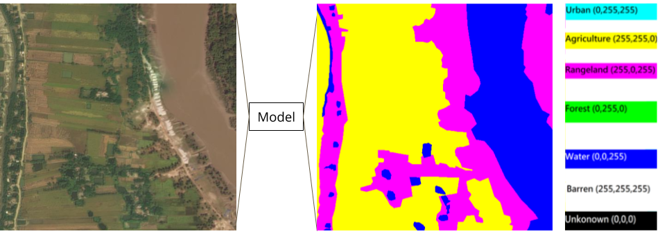
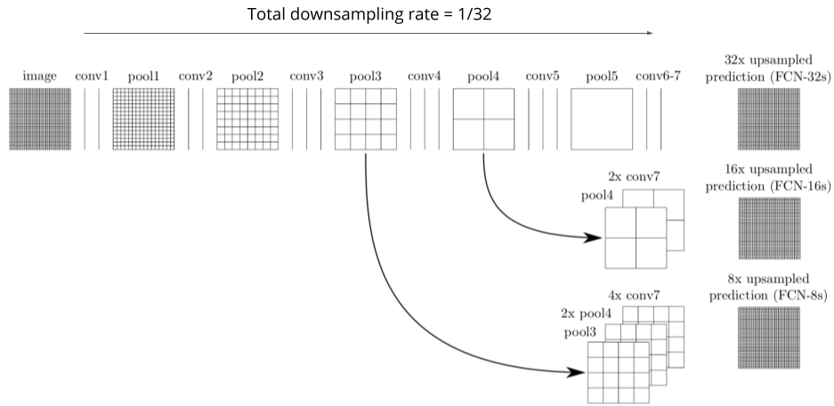
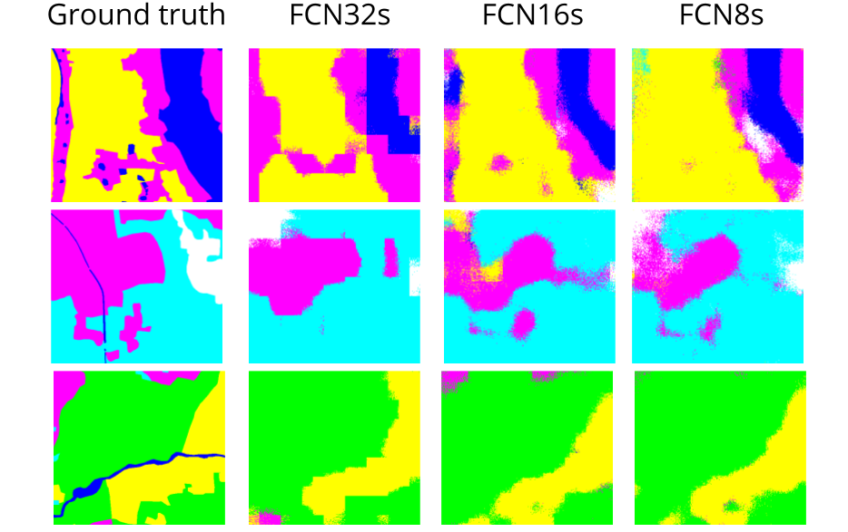

# Semantic Segmentation
To recognize what's in the image in pixel level and generate a semantic mask
- Input: a satellite image
- Output: a semantic mask whose size is equivalent to that input image



## Quick start
Baseline model (FCN32s)
```
./hw3.sh [test_image_directory] [plot_save_directory]
```
- Best model (FCN8s)
```
./hw3_best.sh [test_image_directory] [plot_save_directory]
```

# Model
Fully convolutional network ([FCN](https://people.eecs.berkeley.edu/~jonlong/long_shelhamer_fcn.pdf)) is implemented with **transpose convolution**, a learnable upsampling approach.




## 1. Train

```
python3 train --init_from [pretrained npy] --save_dir [model checkpoint dir] --mode [FCN8s, FCN16s, or FCN32s]
```
- mode = FCN32s
- batch size = 32
- early stopping patience = 50
- learning rate is 1e-4 and half per 2000 steps
- without dropout and weight decay
- input dimension  = (512, 512, 3) and then resize to (256, 256, 3)
- output dimension = (256, 256, 3) and then resize to (512, 512, 3)


## 2. Test

```
python3 test.py --test_dir [testing data dir] --save_dir [model checkpoint dir] --plot_dir [plot dir] --mode [FCN8s, FCN16s, or FCN32s]
```



| FCN32s | FCN16s | FCN8s |
|--------|--------|-------|
| 0.656  | 0.683  | 0.687 |

## 3. Evaluate (mIoU), provided by TAs

```
python3 mean_iou_evaluate.py -g [ground truth dir] -p [plot dir]
```
